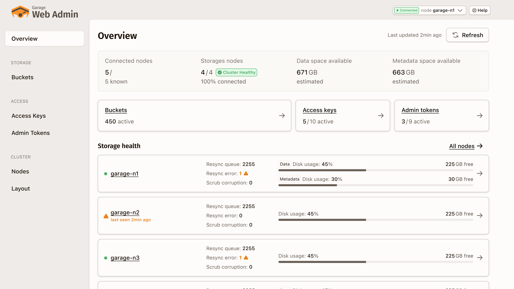

# Garage Web Admin
Administrate your Garage cluster in the browser
---

**In early development state**

## Attributions

- This software is maintained by [Deuxfleurs](https://deuxfleurs.fr) and released under the terms of the AGPLv3
- An initial version is build by [Guérilla.Studio](https://guerilla.studio) with a financial help of the [NLNet foundation](https://nlnet.nl/project/Garage-AdminUI/)
- The [Garage](https://garagehq.deuxfleurs.fr/) logo belong to Deuxfleurs

## Useful links
- [Garage website](https://garagehq.deuxfleurs.fr/)
- [Garage Matrix channel](https://matrix.to/#/#garage:deuxfleurs.fr)
- [The Web Admin UI documentation](https://garage-webadmin-ui-documentation.deuxfleurs.eu/)

## Civil Clause

(*See [Civil Clause](https://en.wikipedia.org/wiki/Civil_clause) on Wikipedia*)

The Garage Web Admin project is committed to peace and justice, and therefore cannot accept donations or partnerships for the benefit of warfare or surveillance systems. This includes civilian police forces.
